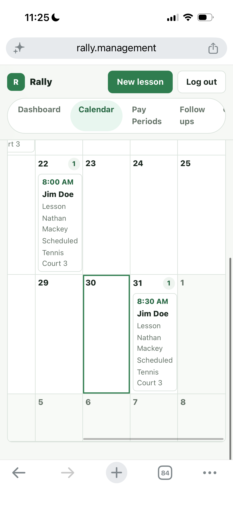

# Rally

Rally is a mobile-first lesson tracker for racquet-sports professionals. It
keeps each pro's schedule, participant contacts, reminder texts, calendar
handoffs, and pay-period records in one place.

[Open Rally](https://rally.management) ·
[Pro guide](./PRO_GUIDE.md) ·
[Security checklist](./SECURITY_CHECKLIST.md)

The live deployment is private. A club invite or approved email address is
required to create an account. All names and phone numbers shown below are
sample data.

<p align="center">
  
</p>

## Why Rally exists

Most lesson management at a small club happens across a calendar, a contact
list, text messages, and a separate payroll record. Rally brings those pieces
together without trying to become a full club-management platform.

A pro can create a lesson in a few taps, reuse a saved participant, open a
ready-to-send reminder in the phone's messaging app, add the lesson to a
personal calendar, and later check the club's two-week pay period for anything
that may have been missed.

Rally deliberately does **not** send messages in the background. Reminder links
open the pro's own SMS app with the recipient and message filled in. The pro
reviews the text and taps Send.

## Product tour

<table>
  <tr>
    <td width="50%" align="center">
      
    </td>
    <td width="50%" align="center">
      
    </td>
  </tr>
  <tr>
    <td valign="top">
      <strong>Create the whole reservation</strong><br>
      Choose a lesson type, assign one or more pros, add participants, pick a
      time, and select one or more courts.
    </td>
    <td valign="top">
      <strong>Reuse club contacts</strong><br>
      Typing a participant's name searches the shared directory. Selecting a
      result fills the saved name and phone number.
    </td>
  </tr>
</table>

<table>
  <tr>
    <td width="50%" align="center">
      
    </td>
    <td width="50%" align="center">
      
    </td>
  </tr>
  <tr>
    <td valign="top">
      <strong>Send reminders from the pro's phone</strong><br>
      Rally writes a natural reminder using the participant, date, time, and
      court, then hands it to the phone's messaging app.
    </td>
    <td valign="top">
      <strong>Keep regular players engaged</strong><br>
      Follow ups ranks frequent lesson contacts and opens a short scheduling
      text for the pro to review and send.
    </td>
  </tr>
</table>

<table>
  <tr>
    <td width="50%" align="center">
      
    </td>
    <td width="50%" align="center">
      
    </td>
  </tr>
  <tr>
    <td valign="top">
      <strong>See an individual schedule</strong><br>
      Dashboard and calendar views show only lessons assigned to the logged-in
      pro, including shared reservations with multiple pros.
    </td>
    <td valign="top">
      <strong>Use a personal calendar</strong><br>
      A signed, expiring calendar link creates a standard <code>.ics</code>
      event for Apple Calendar, Google Calendar, Outlook, and other clients.
    </td>
  </tr>
</table>

<table>
  <tr>
    <td width="50%" align="center">
      
    </td>
    <td width="50%" valign="middle">
      <h3>Cross-check the pay period</h3>
      <p>
        Rally groups each pro's assigned work into the club's two-week pay
        periods. The report includes totals and a breakdown for lessons,
        clinics, other events, Freshmen, Varsity, and Team reservations.
      </p>
      <p>
        It is a reconciliation tool, not a payroll or payment system. Pros can
        compare the report with their pay statement and flag anything that was
        missed.
      </p>
    </td>
  </tr>
</table>

## How the club workflow works

1. A pro signs up with the club invite code and saves a name and phone number
   to their profile.
2. The pro creates a Lesson, Clinic, Other event, Freshmen, Varsity, or Team
   reservation.
3. One or more pros and participants can be assigned to the same reservation.
4. Participant details are saved to the shared club contact directory.
5. Assigned pros see the reservation on their own dashboard and calendar.
6. A reminder button opens a prepared SMS on the pro's phone. Rally can then
   mark the reminder as sent to prevent accidental duplicates.
7. The reservation appears in each assigned pro's pay-period report and can be
   added to a personal calendar.

Lesson times are offered in 15-minute intervals from 6:00 AM through 9:00 PM.
The court picker includes Tennis Courts 1-8, Pickleball Courts 1-4, and Paddle
Courts 1-5.

## Access model

- Each pro has a Supabase Auth login and an `instructor_profiles` record.
- Dashboard, calendar, lesson history, follow ups, and pay-period reports are
  scoped to the logged-in pro's assigned lessons.
- Any pro assigned to a lesson can edit the entire reservation.
- A pro can create a reservation and assign another pro.
- The participant contact directory is shared across the club.
- Signup is closed unless the server has an invite code or email allowlist
  configured.

## Technical overview

| Area | Implementation |
| --- | --- |
| Web app | Next.js App Router, React, TypeScript |
| Authentication | Supabase Auth with server-managed HTTP-only cookies |
| Database | Supabase Postgres |
| Data access | Next.js route handlers using the server-only Supabase service role |
| Messaging | Manual `sms:` links opened in the pro's native messaging app |
| Calendar | Signed, expiring `.ics` downloads |
| Hosting | Vercel |
| Tests | Node test runner with TypeScript fixtures |

Supabase Row Level Security is enabled with no anonymous policies. Browser
requests go through Rally's authenticated server routes; the service-role key
is never sent to the client.

Calendar downloads use a dedicated HMAC secret, expire after 14 days, and are
bound to the pro who generated the link. Signup and login also have a
best-effort in-memory attempt cap. On Vercel that cap is per serverless instance,
so the long random invite code or email allowlist remains the primary signup
control.

## Local setup

### 1. Install the app

```bash
git clone https://github.com/NathanM11230/rally.git
cd rally
npm install
```

### 2. Create the Supabase database

Create a Supabase project, open its SQL Editor, and run:

```text
supabase/schema.sql
```

The schema is written to be rerunnable for an existing Rally database. If an
older deployment only needs the contact directory repair, run
[`supabase/contacts-table.sql`](./supabase/contacts-table.sql).

### 3. Configure Supabase Auth

Enable email/password authentication. Email is used only for account access;
Rally does not send email lesson reminders.

If email confirmation is enabled, set the Supabase Auth Site URL to the
production Rally URL and add both the production URL and
`http://localhost:3000` as allowed redirect URLs.

### 4. Add environment variables

Copy `.env.example` to `.env.local` and set:

| Variable | Purpose |
| --- | --- |
| `SUPABASE_URL` | Supabase project URL |
| `SUPABASE_SERVICE_ROLE_KEY` | Server-only database access |
| `SUPABASE_ANON_KEY` | Supabase Auth login and signup |
| `LESSON_TIME_ZONE` | Club timezone, such as `America/New_York` |
| `SIGNUP_INVITE_CODE` | Long random code shared with approved pros |
| `SIGNUP_ALLOWED_EMAILS` | Optional comma-separated signup allowlist |
| `CALENDAR_TOKEN_SECRET` | Independent random secret for calendar links |

At least one signup gate, `SIGNUP_INVITE_CODE` or `SIGNUP_ALLOWED_EMAILS`, must
be set. Do not reuse the Supabase service-role key as the calendar secret.

### 5. Start Rally

```bash
npm run dev
```

Open [http://localhost:3000](http://localhost:3000). On Windows PowerShell,
`npm.cmd run dev` can be used if `npm` script execution is restricted.

## Verification

Run the focused security tests, lint, and production build before deployment:

```bash
npm test
npm run lint
npm run build
```

The current tests cover signup gating, calendar-token validation, and the auth
attempt limiter.

## Deploying to Vercel

1. Import `NathanM11230/rally` into Vercel and use `main` as the production
   branch.
2. Add the same environment variables listed above to the Production
   environment.
3. Deploy, then update the Supabase Auth Site URL and redirect allowlist with
   the final Vercel or custom domain.
4. Test signup, login, contact creation, lesson creation, a reminder handoff,
   and an Add to calendar link on a real phone.
5. Complete [`SECURITY_CHECKLIST.md`](./SECURITY_CHECKLIST.md) before inviting
   additional pros.

Environment-variable changes require a new Vercel deployment before they take
effect.

## Scope

Rally is intentionally small. It includes scheduling, shared contacts, manual
SMS reminders, calendar handoff, follow ups, and pay-period reconciliation.
It does not include automated SMS delivery, email reminders, billing, payments,
court availability management, or a public registration flow.

For day-to-day instructions, see [`PRO_GUIDE.md`](./PRO_GUIDE.md).
