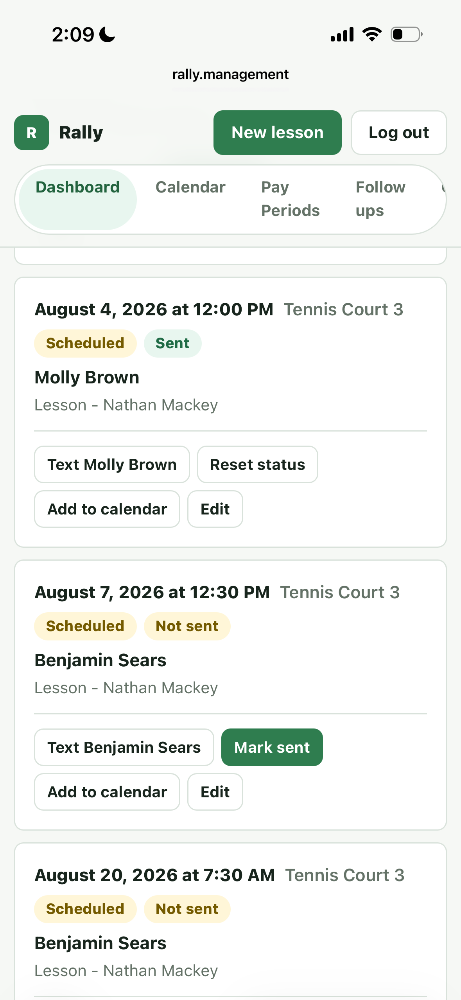

# Rally

Rally is a mobile-first lesson tracker for racquet-sports professionals. It
keeps each pro's schedule, participant contacts, reminder texts, calendar
handoffs, and pay-period records in one place.

[Open Rally](https://rally.management) |
[Pro guide](./PRO_GUIDE.md) |
[Security checklist](./SECURITY_CHECKLIST.md)

The live deployment is private. A club invite or approved email address is
required to create an account. All names and phone numbers shown below are
sample data.

## Why Rally exists

Most lesson management at a club is spread across several different platforms.
At my club, our tennis pros were using one application to reserve courts, their
phones to communicate with members, personal calendar apps to remember their
schedules, and an entirely separate POS system to bill each lesson. None of
those tools gave the pro one complete record. When a lesson changed or a day
got busy, it was too easy for a reminder, calendar entry, or charge to be
missed.

I built Rally to give pros one place to manage their side of that workflow. A
pro can create a Lesson, Clinic, Other event, Freshmen, Varsity, or Team
reservation; assign multiple pros and participants; select one or more courts;
and see only the lessons assigned to them. New participant details are saved
automatically to the shared club contact directory. The next time that person
books, typing a few letters of their name fills both the full name and phone
number.

From the same lesson record, a pro can open a ready-to-send reminder in their
phone's messaging app, add the lesson to a personal calendar, or view it in
Rally's own Calendar tab. The Follow ups page also uses lesson history to show
the people a pro works with most often and prepare a quick text asking when
they would like to hit again. Messages are never sent automatically; the pro
reviews and sends each one personally.

Rally also organizes every assigned lesson into the club's two-week pay
periods. This gives each pro an independent record to compare against the POS
system and their paycheck, making it easier to catch a lesson that was never
billed or a payment discrepancy that otherwise may have gone unnoticed. Rally
does not replace the club's court-booking or POS systems, but it connects the
pro's schedule, contacts, communication, calendar, and pay-period record around
them in an easy-to-navigate and clean UI.

## Product tour

<table>
  <tr>
    <td width="50%" align="center">
      
    </td>
    <td width="50%" align="center">
      
    </td>
  </tr>
  <tr>
    <td valign="top">
      <strong>Run the day from the dashboard</strong><br>
      Each pro sees only lessons assigned to them, with the participant, time,
      court, reminder status, calendar link, and editing controls together.
    </td>
    <td valign="top">
      <strong>Send reminders from the pro's phone</strong><br>
      Tapping the participant's Text button opens a natural reminder with the
      date, time, and court already filled in. The pro reviews it and taps Send.
    </td>
  </tr>
</table>

<p align="center">
  
</p>

### Save contacts while scheduling

Contact saving is part of lesson creation, not a separate administrative step.
When a pro saves a lesson with a new participant, Rally automatically creates
or updates that shared contact. The next time any pro starts typing the person's
name, Rally shows matching contacts beneath the field; one tap fills the full
name and phone number.

This is intentionally name-first because pros usually remember who they taught,
not the person's phone number. Phone numbers are normalized behind the scenes
so formatting differences do not create unnecessary duplicates. Contacts can
also be added directly from the Contacts page when no lesson is being created.

<table>
  <tr>
    <td width="50%" align="center">
      
    </td>
    <td width="50%" align="center">
      
    </td>
  </tr>
  <tr>
    <td valign="top">
      <strong>See who may be ready for another lesson</strong><br>
      Follow ups ranks the people a pro teaches most often and shows their
      lesson count and most recent lesson.
    </td>
    <td valign="top">
      <strong>Start the next conversation</strong><br>
      Tapping Text opens a short, editable scheduling message: "Hey Benjamin,
      any time to hit soon?"
    </td>
  </tr>
</table>

### Follow up from lesson history

Rally uses the logged-in pro's lesson history to surface the people they teach
most often. Tapping Text opens the prepared scheduling message in the phone's
messaging app. Nothing is sent automatically: the pro can edit the wording,
choose when to reach out, and tap Send personally.

### Use a personal calendar

<table>
  <tr>
    <td width="50%" align="center">
      
    </td>
    <td width="50%" align="center">
      
    </td>
  </tr>
  <tr>
    <td valign="top">
      <strong>Tap Add to calendar on the lesson</strong><br>
      Molly Brown's lesson card includes the Add to calendar button. Tapping it
      prepares a calendar event using that specific lesson's details.
    </td>
    <td valign="top">
      <strong>Review and save the event</strong><br>
      The same Molly Brown lesson opens in the phone's calendar with the date,
      time, court, assigned pros, and notes already filled in.
    </td>
  </tr>
</table>

Behind the button, Rally creates a signed, expiring `.ics` calendar link that
works with Apple Calendar, Google Calendar, Outlook, and other clients. Rally
also has its own Calendar tab for pros who prefer to view their assigned lessons
inside the site. Both calendar options show only lessons assigned to the
logged-in pro, including reservations shared with multiple pros.

<table>
  <tr>
    <td width="50%" align="center">
      
    </td>
    <td width="50%" valign="middle">
      <h3>Cross-check the pay period</h3>
      <p>
        Rally groups each pro's assigned work into the club's two-week pay
        periods. The report includes totals and a breakdown for lessons,
        clinics, other events, Freshmen, Varsity, and Team reservations.
      </p>
      <p>
        It is a reconciliation tool, not a payroll or payment system. Pros can
        compare the report with their pay statement and flag anything that was
        missed.
      </p>
    </td>
  </tr>
</table>

## How the club workflow works

1. A pro signs up with the club invite code and saves a name and phone number
   to their profile.
2. The pro creates a Lesson, Clinic, Other event, Freshmen, Varsity, or Team
   reservation.
3. One or more pros and participants can be assigned to the same reservation.
4. Saving the lesson automatically creates or updates each participant in the
   shared club contact directory.
5. Assigned pros see the reservation on their own dashboard and calendar.
6. A reminder button opens a prepared SMS on the pro's phone. Rally can then
   mark the reminder as sent to prevent accidental duplicates.
7. The reservation appears in each assigned pro's pay-period report and can be
   added to a personal calendar.

Lesson times are offered in 15-minute intervals from 6:00 AM through 9:00 PM.
The court picker includes Tennis Courts 1-8, Pickleball Courts 1-4, and Paddle
Courts 1-5.

## Access model

- Each pro has a Supabase Auth login and an `instructor_profiles` record.
- Dashboard, calendar, lesson history, follow ups, and pay-period reports are
  scoped to the logged-in pro's assigned lessons.
- Any pro assigned to a lesson can edit the entire reservation.
- A pro can create a reservation and assign another pro.
- The participant contact directory is intentionally shared across approved
  club pros. Different people can share one phone number without overwriting
  each other's names.
- Signup is closed unless the server has an invite code or email allowlist
  configured.

For a small club with a known pro roster, `SIGNUP_ALLOWED_EMAILS` is the
preferred signup gate. If an invite code is used, it should be long, random,
and shared only with approved pros. Rally provisions approved accounts with
the server-only Supabase admin API; direct public Supabase signup should remain
disabled.

## Technical overview

| Area | Implementation |
| --- | --- |
| Web app | Next.js App Router, React, TypeScript |
| Authentication | Supabase Auth with server-managed HTTP-only cookies |
| Database | Supabase Postgres |
| Data access | Next.js route handlers using the server-only Supabase service role |
| Messaging | Manual `sms:` links opened in the pro's native messaging app |
| Calendar | Signed, expiring `.ics` downloads |
| Hosting | Vercel |
| Tests | Node test runner with TypeScript fixtures |

Supabase Row Level Security is enabled with no anonymous policies. Browser
requests go through Rally's authenticated server routes; the service-role key
is never sent to the client.

Calendar downloads use a dedicated HMAC secret, expire after 15 minutes, are
bound to the pro who generated the link, and are served with `no-store` cache
headers. Logout revokes the Supabase refresh session and increments the pro's
calendar token version, immediately invalidating outstanding calendar links.
Signup and login also have a best-effort in-memory attempt cap. On Vercel that
cap is per serverless instance, so the long random invite code or email
allowlist remains the primary signup control.

## Capacity and scaling

Rally's lesson data is stored in Supabase, not on the Vercel server. As of July
2026, the Supabase Free plan includes a 500 MB database and places the database
in read-only mode if that limit is exceeded. Existing records remain readable,
but new lessons and edits would fail until storage is reduced or the project is
upgraded. 

Based on Rally's current tables and indexes, roughly 75,000–200,000 typical reservations 
fit within the 500 MB limit. The range is wide because multiple participants, long notes, 
database overhead, and index growth all affect per-row size. At a combined 10 lessons
per day for two pros, six days per week, even the low end represents more than 24 years of 
lesson history.

Vercel processes the web requests but does not retain the lesson records.
Vercel Hobby currently includes up to 1,000,000 function invocations per month,
far beyond the expected traffic from two pros. 

Lesson reads are filtered by assigned pro and date in Supabase rather than
loading the club's full history into the Next.js server. Dashboard and calendar
reads are bounded, and follow-up analysis currently examines at most 5,000
assigned lessons. A larger multi-club version should add cursor pagination and
database-side aggregate queries before increasing those bounds.

## Local setup

### 1. Install the app

```bash
git clone https://github.com/NathanM11230/rally.git
cd rally
npm install
```

### 2. Create the Supabase database

Create a Supabase project, open its SQL Editor, and run:

```text
supabase/schema.sql
```

The schema is written to be rerunnable for an existing Rally database. If an
older deployment only needs the contact directory repair, run
[`supabase/contacts-table.sql`](./supabase/contacts-table.sql).

Rerunning the full schema also installs the safe profile foreign keys: deleting
an Auth user unlinks rather than deletes the pro profile, and a profile cannot
be deleted while lessons still reference it. Set a departing pro's `is_active`
value to `false` instead; disabled pros cannot log in or be assigned new lessons,
but remain visible on historical records.

### 3. Configure Supabase Auth

Enable email/password authentication, then disable public new-user signup in
the Supabase Auth settings. Rally's gated `/api/auth/signup` route uses the
server-only service role to provision approved users, so the Rally signup form
continues to work. Email is used only for account access; Rally does not send
email lesson reminders.

### 4. Add environment variables

Copy `.env.example` to `.env.local` and set:

| Variable | Purpose |
| --- | --- |
| `SUPABASE_URL` | Supabase project URL |
| `SUPABASE_SERVICE_ROLE_KEY` | Server-only database access |
| `SUPABASE_ANON_KEY` | Supabase Auth login and session renewal |
| `LESSON_TIME_ZONE` | Club timezone, such as `America/New_York` |
| `SIGNUP_INVITE_CODE` | Long random code shared with approved pros |
| `SIGNUP_ALLOWED_EMAILS` | Optional comma-separated signup allowlist |
| `CALENDAR_TOKEN_SECRET` | Independent random secret for calendar links |

At least one signup gate, `SIGNUP_INVITE_CODE` or `SIGNUP_ALLOWED_EMAILS`, must
be set. Do not reuse the Supabase service-role key as the calendar secret.

### 5. Start Rally

```bash
npm run dev
```

Open [http://localhost:3000](http://localhost:3000). On Windows PowerShell,
`npm.cmd run dev` can be used if `npm` script execution is restricted.

## Verification

Run the regression tests, lint, type check, and production build before
deployment:

```bash
npm test
npm run lint
npm run typecheck
npm run build
```

The current tests cover signup gating, calendar-token validation, auth session
renewal, trusted account claims, the attempt limiter, timezone and pay-period
boundaries, lesson input validation, shared-phone contact matching, and
multi-pro lesson assignment. GitHub Actions runs the same checks for pushes to
`main` and for pull requests.

## Deploying to Vercel

1. Import `NathanM11230/rally` into Vercel and use `main` as the production
   branch.
2. Add the same environment variables listed above to the Production
   environment.
3. Deploy, then update the Supabase Auth Site URL and redirect allowlist with
   the final Vercel or custom domain.
4. Test signup, login, contact creation, lesson creation, a reminder handoff,
   and an Add to calendar link on a real phone.
5. Complete [`SECURITY_CHECKLIST.md`](./SECURITY_CHECKLIST.md) before inviting
   additional pros.

Environment-variable changes require a new Vercel deployment before they take
effect.

## Scope

Rally is intentionally small. It includes scheduling, shared contacts, manual
SMS reminders, calendar handoff, follow ups, and pay-period reconciliation.
It does not include automated SMS delivery, email reminders, billing, payments,
court availability management, or open public registration.

Reminder status is lesson-level: for a lesson with several participants, the
pro sends each prepared text and then uses **Mark all sent**. It is a workflow
check, not an SMS delivery receipt. Pay-period reports intentionally include
every item entered for the period, including cancelled and no-show records, so
the pro can reconcile the full schedule against payroll.

Manual reminder links depend on the phone's `sms:` handling. iPhone opens the
prepared body reliably in the tested flow, while some Android messaging apps
may open the recipient without the body. Lesson creation cleans up its parent
record if assignment or participant writes fail, but lesson edits are not a
multi-user database transaction; if two pros edit the same lesson at once, the
last saved change wins.

For day-to-day instructions, see [`PRO_GUIDE.md`](./PRO_GUIDE.md).
